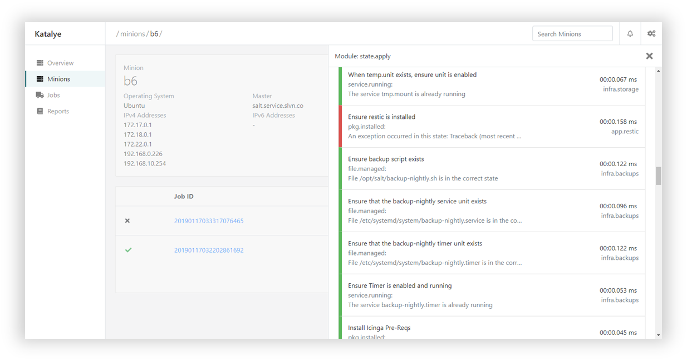

# Katalye

[](https://ci.appveyor.com/project/Silvenga/katalye)
[](https://hub.docker.com/r/katalye/katalye-api)
[](https://github.com/Katalye/Katalye/blob/master/LICENSE)

## Introduction

Katalye is an enterprise class SaltStack UI solution, providing rich insights into a SaltStack cluster. Built by DevOps for DevOps to more easily maintain and scale a SaltStack deployment.

Rather than simply providing a UI around the SaltStack API or SaltStack python models, Katalye attempts to integrate directly into SaltStack using standardized API's. This gives Katalye the speed, flexibility, stability, and maintainability required to scale and grow.

> Katalye is under rapid development. Feeback at this early stage is welcome.

The UI component of Katalye can be found [here](https://github.com/Katalye/Katalye.UI).



## Future

#### Phase 1
- Read-only view into a SaltStack Cluster.
- Provide insights and historical information about minions and jobs.
- Gather an inventory of salt minions and basic information.
- Gather information about authentication statistics. 
- Settings page + diagnoses.
- Minions overview.

#### Phase 2
- Authentication - LDAP, Salt-API.
- User management.
- Alerts on failed jobs and rejected keys - Email, Web UI.
- Notification feed.
- Basic reporting.

#### Phase 3
- Basic support for executing common modules.
- Basic support for executing highstate.

## Setup

### Salt API

The Salt API is a required component. The Salt API is normally shipped in the `salt-api` package and should be installed along with the `salt-master`.

```bash
# For example, on Ubuntu:
sudo apt-get update
sudo apt-get install salt-api
```

There are three backends that are shipped with `salt-api`. Theoretically, any standard backend will work, but `rest_cherrypy` is used in this example. Further documentation e.g. using SSL, etc. can be found [here](https://docs.saltstack.com/en/latest/ref/netapi/all/salt.netapi.rest_cherrypy.html).

```yaml
# /etc/salt/master.d/api.conf
rest_cherrypy:
  port: 8000
  disable_ssl: true
```

> A restart of the `salt-master` is required to active these configurations.

Next, authentication needs to be configured. The simplest authentication scheme for the `salt-api` is standard `pam`. Other schemes will be supported e.g. LDAP, etc. - but `pam` is used in this example.

Create the user where the `salt-api` is located:

```bash
# Create a system user named katalye
useradd --system katalye
# Set the user's katalye password to SilverLight
echo 'katalye:SilverLight' | chpasswd
``` 

Then authorize the created user to perform actions on the `salt-api`. More information about `eauth` can be found [here](https://docs.saltstack.com/en/latest/topics/eauth/index.html).

```yaml
# /etc/salt/master.d/api-auth.conf
external_auth:
  pam:
    katalye:
      - 'grains.items'
```
> A restart of the `salt-master` is required to active these configurations.

Currently, the following permissions are required, more will be added as new features are created:
- `grains.items` Used to retrieve grains from minions.

### Returner

The `katalye` returner is a required component. The `katalye` returner is used to retrieve events directly from the SaltStack event bus.

The easiest way to install the `katalye` returner is to drop [`katalye.py`](https://github.com/Katalye/Katalye/blob/master/katalye.py) into the `_returners` directory within the [`file_roots`](https://docs.saltstack.com/en/latest/ref/configuration/master.html#std:conf_master-file_roots) specified by the master config file. More documentation can be found [here](https://docs.saltstack.com/en/latest/ref/returners/#using-custom-returner-modules).

> Executing `salt '*' saltutil.sync_returners` may be required to update the sync the returner with the SaltStack cluster.

This returner may be updated from time-to-time. Care should be made to ensure it stays compatible with the Katalye API.

To activate and configure the `katalye` returner master configurations are required:

```yaml
# /etc/salt/master.d/katalye.conf
event_return: katalye # Enables katalye, reqired.
katalye.server: katalye.example.com:5000 # String, the resolvable Katalye server, required.
katalye.secure: False # Boolean, defaults to False.

state_events: True # Enables progress events for jobs, optional, not currently used.
presence_events: False # Enables minion presence detection, optional, not currently used.
```

> A restart of the `salt-master` is required to active these configurations.

### Katalye

Katalye is made of two components - the `katalye-api` and the `katalye-ui`. The `katalye-api` requires a PostgreSQL database to store historical job information, to provide caching of minion state, and to share state between `katalye-api` workers (in a load balanced scenario). The `katalye-ui` provides the UI around the `katalye-api`.

Currently, the only support method of deploying Katalye is with Docker. An example [`docker-compose.yaml`](https://github.com/Katalye/Katalye/blob/master/docker-compose.yaml) can be used.

The following environment variables are supported:
- `KATALYE__SALT__API`: Required. The URI of the salt API, must be resolvable. Supports both http and https.
- `KATALYE__SALT__USER`: Required: The Katalye username.
- `KATALYE__SALT__PASSWORD`: Required: The Katalye password.
- `CONNECTIONSTRINGS__KATALYECONTEXT`: Required: The connection formation for the PostgreSQL database. [Supported format](https://www.connectionstrings.com/postgresql/).

> Note the double underscores in some varribles.

If using `docker-compose` deployment is as simple as:

```
docker-compose up -d
```


## Usage

Once the docker containers are running, Katalye will execute automatic migrations against the database. At this point, the web UI should be functional. The example `docker-compose.yaml` exposes this UI on port `5000` which is accessible via your browser `http://<docker host>:5000`.

Current, Katalye lazily discovers minions - meaning, if no event traffic for a minion has been seen by Katalye, no minions will be visible. You can wait for normal events to occur within the SaltStack cluster or you can manually dispatch a job to all minions. For example:

```bash
salt \* test.ping
```
